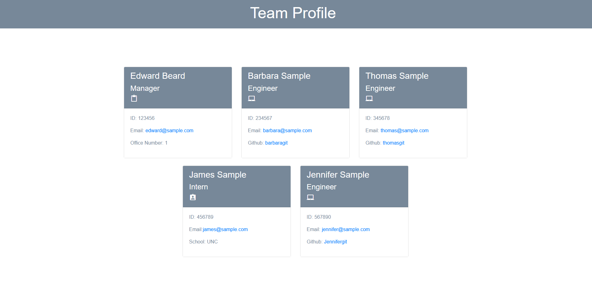

# team-profile-generator
  ## Badges
  
  
  ## Table of Contents
  * [License](#license)
  * [Description](#description)
  * [Installation](#installation)
  * [Usage](#usage)
  * [How to Contribute](#how-to-contribute)
  * [Tests](#tests)
  * [Questions?](#questions)
  
  ## License
  Read more about MIT here:
  [MIT](https://opensource.org/licenses/MIT)
  
  ## Description
  This application was created to generate team profile information based on a user input leveraging the inquirer module from node.js. The information will be displayed on a newly generated html page. 

  
  
  ## Installation
  User will need to clone the repository and install node. This applicatio also requires file systam & node modules. If testing is needed, user can leverage Jest. 
  
  ## Usage
  Run "node index". You will run through a series of questions that will automatically create a team profile. You can see a demonstration [here](https://youtu.be/RB9qnSIlLo4)
  
  ## How to Contribute
  [Contributor Covenant](https://www.contributor-covenant.org/)  
  Not Applicable
  
  ## Tests
  Run "npm test" to run test on constructors. 
  
  ## Questions?
  ### Reach me here: 
  [erbeard](https://github.com/erbeard)  
  sample@sample.com
